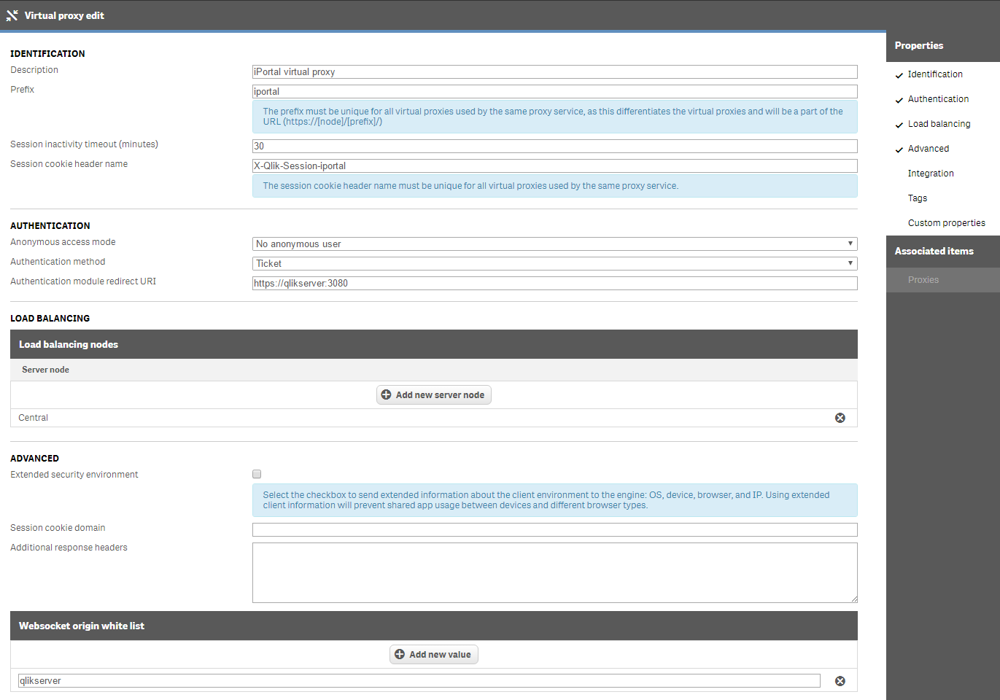
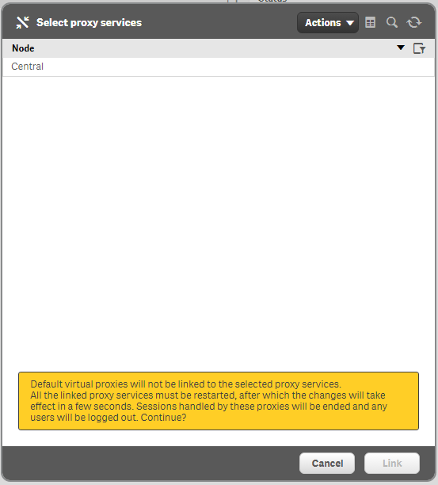

# iPortal Development Environment Setup

If you would like to modify the iPortal source code, follow the configuration guidelines below. 

Configuring an iPortal development environment involves the following steps:

1. Install prerequisite software (Git, Node.js and your editor of choice - I prefer Visual Studio Code)
2. Clone the iPortal repository from GitHub.com (requires a GitHub account and access to the eapowertools/iPortal repository)
3. Configure the Qlik Sense Service Dispatcher
4. Create a new Virtual Proxy (VP) for the iPortal application
5. Create a new User Directory Connector (UDC) for iPortal users
6. Configure a User access rule to grant iPortal users access to Qlik Sense

> This configuration guide assumes the hostname for the Qlik Sense server is **qlikserver**.  If your Qlik Sense server hostname is different, you will need to substitute your Qlik Sense hostname name for **qlikserver** throughout this guide.  

> You will also need to edit the hostname property in [IPORTAL_INSTALL]\config\config.js to match your Window's computer name. 

> The iPortal application uses an Excel ODBC User Directory Connector to import the iPortal users. You may need to install the Microsoft Access Database Engine to get the required ODBC drivers.  You can [download](https://www.microsoft.com/en-us/download/confirmation.aspx?id=13255&6B49FDFB-8E5B-4B07-BC31-15695C5A2143=1) the 64 bit drivers from Microsoft.

## Guide Conventions

**[QLIK_INSTALL]** - This is the fully qualified path for the Qlik Sense install (ex: c:\Program File\Qlik\Sense)

**[IPORTAL_INSTALL]** - This is the fully qualified path for the iPortal application install (ex: c:\Program Files\Qlik\Sense\ServiceDispatcher\Node\iPortal)

## iPortal Step-by-Step Installation Guide

1. Install [Node.js](https://nodejs.org/en/).  Node.js Package Manager (npm) is required to install the iPortal module dependencies.
2. Install [Git](https://git-scm.com/downloads).  Git is required to interact with the iPortal GitHub source code repository.       
3. Clone the iPortal repository to your **[IPORTAL_INSTALL]** directory. 
4. Open the **Windows Command Prompt** and navigate to the **[IPORTAL_INSTALL]** directory.  Enter the following command:

    ```
    npm install
    ```

4. Add the following service configuration data to the **[QLIK_INSTALL]\ServiceDispatcher\services.conf** file.  The last line of the configuration data must point to the **server.js** file located in the root directory of your cloned iPortal project.

    ```
    [iportal]
    Identity=iportal
    Enabled=true
    DisplayName=iPortal
    ExecType=nodejs
    ExePath=Node\node.exe
    Script=Node\iportal\server.js
    ```

5. Restart the **Qlik Sense Service Dispatcher** Windows Service.
6. Create a new *Virtual Proxy* within the Qlik Sense QMC as defined below:

    

    ```
    Attributes that need to be modified in the form:
    
    Description: iPortal Virtual Proxy
    Prefix: iportal
    Session cookie header name: X-Qlik-Session-iportal
    Authentication module redirect URI: https://qlikserver:3090
    Load balancing nodes: Make sure the Central node is added
    Websocket origin white list: qlikserver
    ```
7. Select **Proxies** from the **Associated Items** tab menu on the right side of the page and select **Central** from the Node list.  Click the **Link** button to complete the action.

    

8. Create a new *User Directory Connector* for iPortal users within the Qlik Sense QMC as defined below: 

    
    
    ```
    Attributes that need to be modified in the form:
    
    Name: iPortal UDC
    Type: Excel (via ODBC)
    User Sync Settings: Make sure the checkbox is UNCHECKED
    User directory name: iPortal
    User table name: [Users$]
    Attributes table name: [Attributes$]
    Visible connection string: DRIVER={Microsoft Excel Driver (*.xls, *.xlsx, *.xlsm, *.xlsb)};DBQ=C:\Program Files\Qlik\Sense\ServiceDispatcher\Node\iPortal\udc\excel\iportal_users.xlsx
    ```

9. **Sync** the newly created iPortal UDC to load the iPortal users.

10. Add a *User access rule* to grant all users from the *iPortal* User Directory  a user access token.

    
    
    ```
    Attributes that need to be modified in the form:
    
    Name: iPortal UDC user access rule
    BASIC: Select userDirectory from user attribute list and select iPortal for the value
    ```
    
11. Open a browser and access [https://qlikserver:3090](https://qlikserver:3090) or [https://qlikserver/iportal/hub](https://qlikserver/iportal/hub)!
